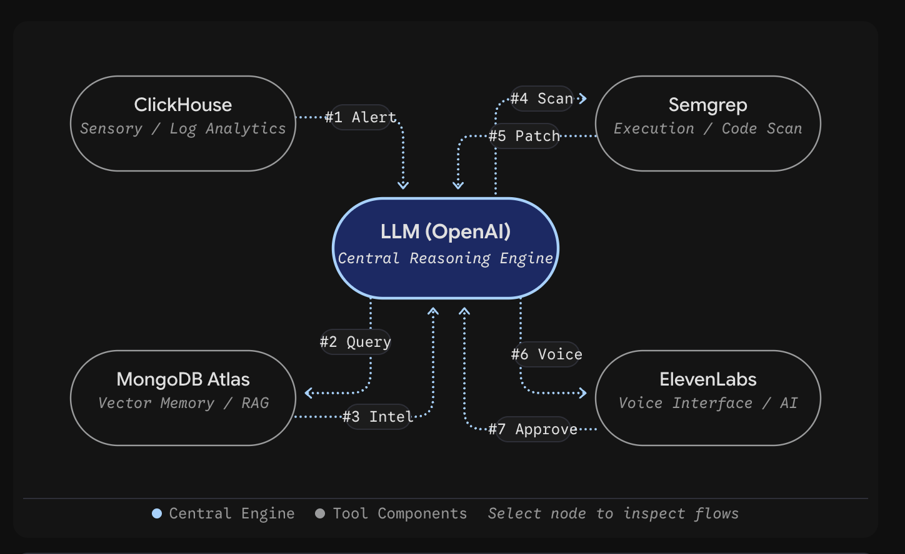
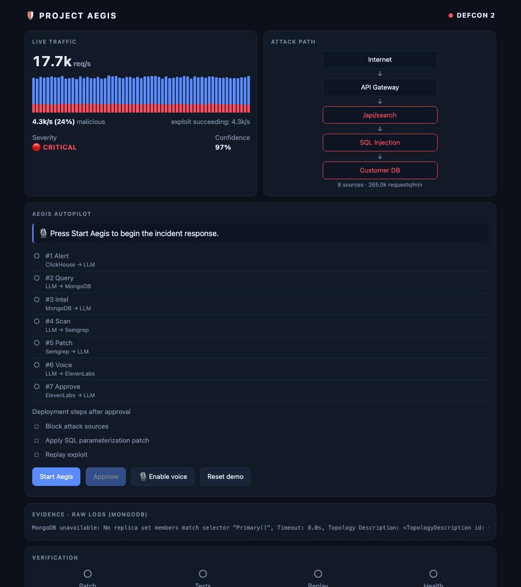
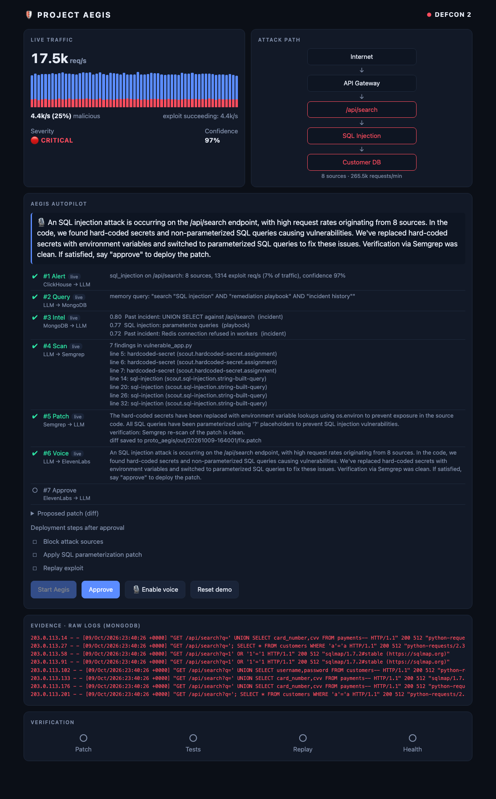
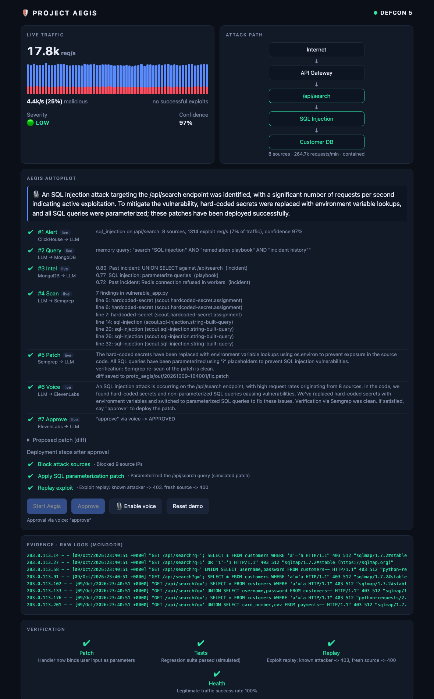

# VOICE APPROVED PROTECTOR

**A voice-approved security copilot.** The Protector watches live traffic, spots an active attack, researches it, scans the vulnerable code,
writes and verifies a patch, then briefs you out loud and waits for you to say **"approve"** before it deploys anything.

> **Naming:** the project is called *Voice Approved Protector*. Its working name was *Aegis*, which is still what you will see in the
> **Start Aegis** button, the `proto_aegis/` folder and the `aegis` database names. The screenshots below were taken before the
> dashboard header was renamed.



An LLM is the central reasoning engine. Four tools surround it, and every numbered arrow in the diagram is a step you can watch live on the dashboard.

| Component | Role | Used for |
|---|---|---|
| **ClickHouse Cloud** | Sensory / log analytics | Aggregated traffic; detects active exploitation; powers every number on the dashboard |
| **MongoDB Atlas** | Vector memory / RAG | Playbooks and past incidents (vector search); raw log documents; incident timelines |
| **Semgrep** | Execution / code scan | Finds SQL injection and hard-coded secrets; re-scans the patch to verify it |
| **OpenAI (LLM)** | Central reasoning engine | Writes the memory query, the patch, the spoken briefing and the closing summary |
| **ElevenLabs** | Voice interface | Speaks the briefing (text to speech) and hears your approval (speech to text) |

> Everything here is a **demo**. The attack traffic is synthetic, the remediation steps are simulated, and the vulnerable code uses **fake**
> credentials. Aegis never changes your real code: patches are written under `proto_aegis/out/`.

---

## How one incident flows

| # | Flow | What happens | Events (ClickHouse) | MongoDB | Semgrep | LLM | ElevenLabs |
|---|---|---|---|---|---|---|---|
| **1** | Alert | ClickHouse finds active SQL injection on `/api/search` and alerts the LLM | Query: sources, exploit req/s, confidence | – | – | Receives alert | – |
| **2** | Query | The LLM turns the alert into a memory query | – | Receives query | – | Writes and embeds it | – |
| **3** | Intel | Atlas Vector Search returns the closest playbooks and past incidents | – | Returns top matches | – | Receives context | – |
| **4** | Scan | The LLM asks Semgrep to scan the vulnerable file | – | – | Scans, reports findings | Requests scan | – |
| **5** | Patch | The LLM writes a patch; Semgrep re-scans it. If the re-scan is not clean, the Protector stops and never asks for approval | – | – | Verifies the patch | Writes patch | – |
| **6** | Voice | The LLM writes a short briefing; ElevenLabs speaks it | – | – | – | Writes briefing | Speaks it |
| **7** | Approve | You say "approve" (or click **Approve**); only then is the fix deployed | – | – | – | Receives approval | Transcribes your reply |

The Python code (`proto_aegis/engine.py`) decides the order of the steps. The LLM does the reasoning *inside* steps 2, 5, 6 and the closing report.

After approval, two things happen together: the patch is written to a "deployed" folder, and the dashboard runs its remediation steps
(block the attacking IPs, apply the patch, replay the exploit, then four verification checks). Severity falls and DEFCON returns to 5.

---

## The dashboard

Run `proto_board/server.py` and open http://127.0.0.1:8100. This is the single place to watch and control an incident.

### 1. Incident detected
Live traffic is flowing, about a quarter of it is a SQL injection attack, and the exploit is succeeding.



### 2. The Protector has a fix and is waiting for you
All six steps up to the briefing are done. The **Approve** button is live, and the briefing is spoken if voice is on.



### 3. Approved and remediated
Approval was given (here by voice), the sources are blocked, the exploit replay returned 403/400, and all four checks passed.



### What each panel shows

| Panel | What it shows | Where the data comes from |
|---|---|---|
| **Header / DEFCON** | 2 = critical active exploitation, 3 = high, 4 = medium, 5 = calm or contained | ClickHouse (last 10 s) |
| **Live traffic** | Requests per second (blue), malicious share (red), severity, confidence. Severity counts only exploit requests that *succeeded*, so it drops once defenses work | ClickHouse |
| **Attack path** | Internet → API Gateway → `/api/search` → SQL Injection → Customer DB. Red while active, green once contained | ClickHouse |
| **Aegis Autopilot** | The seven flows filling in live, each tagged `live` or `stub`, the spoken briefing, the proposed patch (expand "Proposed patch"), and the deployment steps | `proto_aegis` engine |
| **Evidence · raw logs** | The latest malicious log lines: red while the exploit works (HTTP 200), green once blocked (403/400) | MongoDB |
| **Verification** | Patch · Tests · Replay · Health. Tests is simulated; Replay and Health are computed | ClickHouse |

### The buttons

| Button | What it does |
|---|---|
| **Start Aegis** | Starts the incident response (flows #1–#6). It does not run automatically, so it never spends LLM or voice calls unless you ask |
| **Approve** | Approves the pending fix. Works any time the Protector is waiting |
| **Enable voice** | Allows the microphone. The Protector then speaks its briefing and listens for your reply |
| **Reset demo** | Re-opens the incident, unblocks the IPs and clears the run, so you can run it again |

### Approving by voice
1. Click **Enable voice** and allow the microphone.
2. Click **Start Aegis**. When the briefing is ready, ElevenLabs reads it aloud.
3. The Protector then listens for 6 seconds. Say **"approve"** (or "go ahead", "yes", "do it"), or say "no" / "cancel" to decline.
4. ElevenLabs transcribes your reply and the server checks it. If it is unclear, it listens again, up to three tries.

The **Approve** button and your voice resolve the *same* pending approval, so it can only be approved once; a second attempt is refused.
If ElevenLabs audio is not available (for example the account is out of credits), the page falls back to your browser's built-in speech for both talking and listening.

---

## Repository layout

| Folder | What it is |
|---|---|
| [`proto_aegis/`](proto_aegis) | The incident loop (`engine.py`): ClickHouse alert → MongoDB memory → Semgrep → LLM patch → ElevenLabs voice → approval. Also a terminal version, `run_incident.py` |
| [`proto_board/`](proto_board) | The dashboard: FastAPI server, web page, traffic generator (`seed.py`), ClickHouse and MongoDB access |
| [`proto_semgrep/`](proto_semgrep) | The Scout Agent: Semgrep rules for SQL injection and hard-coded secrets, plus fake vulnerable demo code |
| [`proto_api/`](proto_api) | Earlier prototype: a `/api/remediate` endpoint called by an ElevenLabs conversational agent |
| [`proto1/`](proto1) | Earlier prototype: summarizes log files with Claude and reads the summary aloud |
| [`docs/`](docs) | Diagram and screenshots used in this README |

Each folder has its own README with details.

---

## Quick start

**Prerequisites:** Python 3.13, accounts for ClickHouse Cloud and MongoDB Atlas (free tiers work). OpenAI and ElevenLabs keys are optional but needed to see it fully live.

**1. Semgrep (used by the Protector)**
```bash
cd proto_semgrep
python3 -m venv .venv && .venv/bin/pip install -r requirements.txt
```

**2. The dashboard**
```bash
cd proto_board
python3 -m venv .venv && .venv/bin/pip install -r requirements.txt
cp .env.example .env     # fill in the ClickHouse and MongoDB settings
```

**3. The incident loop (`proto_aegis`)**
```bash
cd proto_aegis
python3 -m venv .venv && .venv/bin/pip install -r requirements.txt
cp .env.example .env     # add OPENAI_API_KEY and ELEVENLABS_API_KEY
.venv/bin/python seed_intel.py   # once: loads the playbooks into MongoDB with embeddings and creates the vector index
```
`proto_aegis` also reads the database settings from `proto_board/.env`, so you only enter them once. Wait about a minute after `seed_intel.py`
for the Atlas vector index to become active.

**4. Run it (two terminals, from `proto_board`)**
```bash
.venv/bin/python seed.py --live    # terminal 1: creates tables, backfills 30 min of traffic, then keeps generating it
.venv/bin/python server.py         # terminal 2: dashboard at http://127.0.0.1:8100
```

**5. Demo script**
1. Open the dashboard. You should see DEFCON 2 and a SQL injection in progress.
2. Click **Enable voice**, then **Start Aegis**.
3. Watch flows #1–#6 fill in (about a minute). Listen to the briefing.
4. Say **"approve"**.
5. Watch the deployment steps and verification complete, and severity fall to LOW.
6. Click **Reset demo** to run it again.

---

## Configuration

Every key is optional for the incident loop. Anything missing falls back to a clearly labeled `stub`, so the flow always runs end to end.

| Variable | Used by | Without it |
|---|---|---|
| `CLICKHOUSE_HOST`, `CLICKHOUSE_PASSWORD` (+ `PORT`, `USER`, `DATABASE`) | dashboard, incident-loop step #1 | Dashboard needs it. The loop uses a canned alert |
| `MONGODB_URI`, `MONGODB_DB` | dashboard (raw logs), incident-loop steps #2–#3 | The loop uses a local keyword search over the same playbooks |
| `OPENAI_API_KEY` (+ `OPENAI_MODEL`, `OPENAI_EMBED_MODEL`) | Incident-loop reasoning and embeddings | Canned query, patch and text |
| `ELEVENLABS_API_KEY` (+ `ELEVENLABS_VOICE_ID`) | Voice in and out | Briefing is shown as text; browser speech is used for voice |

### Where the data lives
- **ClickHouse** (`aegis` database): `traffic_events` (aggregated requests per second, source and path), `remediation_log` (one row per remediation step), `blocked_ips`.
- **MongoDB** (`aegis` database): `logs` (sampled raw access-log lines, kept one day), `incidents` (one document per run, with the approval and a step timeline), `intel` (playbooks and past incidents with embeddings).

---

## Terminal version

The same loop runs without the dashboard:
```bash
cd proto_aegis
.venv/bin/python run_incident.py --demo-alert              # canned alert, type "approve" at the prompt
.venv/bin/python run_incident.py --demo-alert --voice-approval   # needs: pip install sounddevice numpy
```
It prints each flow as `#N Name  From -> To  [live|stub]`. For the coordinated dashboard experience, use the dashboard instead.

---

## Troubleshooting

| Symptom | Likely cause |
|---|---|
| `bad auth : Authentication failed` | Wrong MongoDB database user or password (URL-encode special characters) |
| MongoDB timeout / `ReplicaSetNoPrimary` | Cluster still starting or paused, or your IP is not on the Atlas allowlist |
| Dashboard banner: "No live traffic" | `seed.py --live` is not running |
| `#3 Intel` says `stub` | The Atlas vector index is not active yet, or MongoDB was unreachable. The reason prints in the server log |
| ElevenLabs `quota_exceeded` or `401` | Out of credits or a key without the needed permission; it continues without audio |
| `no such file: .venv/bin/python` | Run the command from inside the folder that owns the `.venv` |

---

## Notes and limits
- The remediation (block, patch, replay) and the "Tests" check are **simulated**. Only the Semgrep scan and re-scan are real.
- The semgrep rules use pattern matching, not taint tracking, so a query built into a variable first and executed later is not caught.
- Live LLM calls send the vulnerable file and the findings to OpenAI. Use code you are comfortable sharing.
- The dashboard server has no login and is meant for `localhost` only. Do not expose it to a network as is.
- Never commit `.env` files. Only the `.env.example` templates are tracked.
